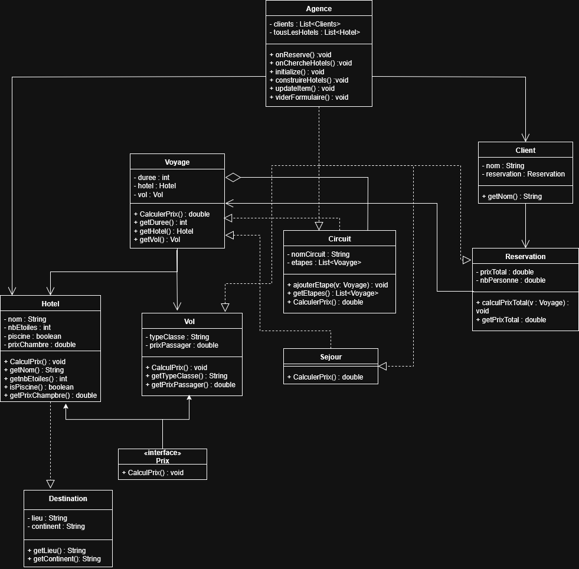

# Agence de Voyage – Projet Java / JavaFX

Projet fais en cours de POO. Ce projet est une petite agence de voyage où l'on peut créer des clients et leurs envies de voyage

## Notre groupe

Osmont Raphaël, Bobin Junca Nils, Lafontaine Paul

## Fonctionnalités

- Création d’un client avec :
    - Nom, nombre de personnes, durée du séjour
- Choix du type de voyage :
    - Séjour simple
    - Circuit (ensemble de plusieurs séjours)
- Gestion des séjours :
    - Filtre des hôtels par nombre d’étoiles et présence de piscine
    - Calcul du prix d’un séjour en fonction de l’hôtel, du vol et du nombre de jours
- Gestion des circuits :
    - Sélection d’un continent
    - Construction d’un circuit à partir de plusieurs hôtels
    - Calcul du prix total d’un circuit (somme des 3 étapes)
- Gestion des vols :
    - Choix de la classe (Économie, Première, Business)
    - Ajustement du prix selon la classe
- Gestion des réservations :
    - Calcul du prix total selon le nombre de personnes
    - Historique des clients et de leur prix total dans une liste

## Modèle objet (POO)

### Principales classes du modèle :

- `Destination`, `Hotel`, `Vol`
- `Voyage` (abstraite), `Sejour`, `Circuit`
- `Reservation`, `Client`
- Interface `Prix` pour le calcul de prix.
- `Agence`pour la connexion avec JavaFX et la POO

## Diagramme UML

## Lancement du projet

1. Importer le projet Maven dans IntelliJ IDEA.
2. Vérifier les dépendances JavaFX dans `pom.xml`
3. Lancer la classe `HelloApplication`